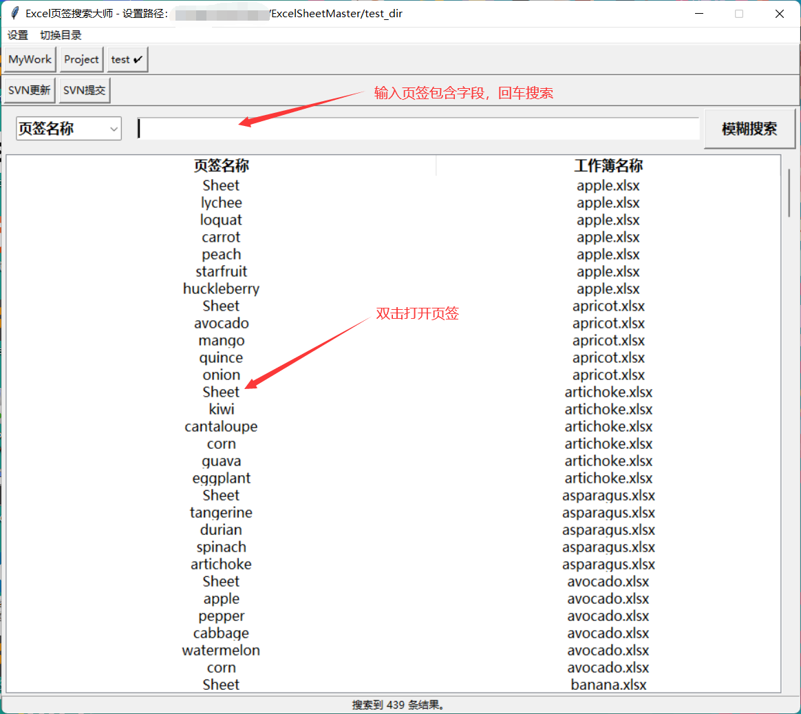

# Excel 页签搜索大师（Excel Tab Search Master）
功能特性：能够搜索指定目录下 Excel 文件的页签，通过双击可快速打开目标页签。在面对成百上千个需要维护的 Excel 文件时，此工具可助力你便捷查找页签，实现快捷操作。（Features: It can search the tabs of Excel files in the specified directory. Double-clicking can quickly open the target tab. When facing hundreds or thousands of Excel files that need to be maintained, this tool can help you find tabs conveniently and achieve quick operations.）

# 界面(Interface)


# 依赖(Dependencies)

## 保存依赖(Saving Dependencies)
```bat
pip freeze > requirements.txt
```

## 安装依赖(Installing Dependencies:)
```bat
pip install -r requirements.txt
```